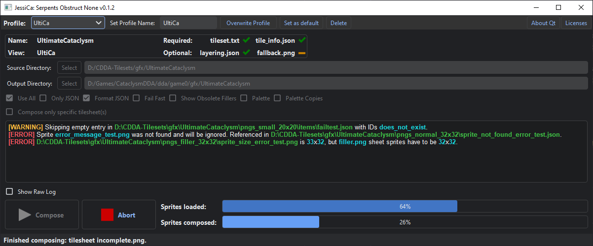

# JessiCa: Serpents Obstruct None

***JessiCa: Serpents Obstruct None**** is (going to be) a *Qt 6*-powered tileset configurator for *Cataclysm: Dark Days Ahead*. Currently, *JessiCa* is in an early prototyping/alpha stage, but its core GUI wrapper for `compose.py` is mostly functional. For 64-Bit *Windows 10+*, *JessiCa* standalone releases are bundled with everything it needs for tileset composing. Most notably, this includes a minimal *Python* runtime, *libvips*, and the tileset composing script itself. No further installations or setting of environment variables required - just unzip and run `JessiCa.bat`.



Currently implemented features:
- For **Windows 10**+ required libraries preinstalled.
- Save and switch between configuration profiles, e.g. one for each tileset. Set a profile to be loaded by default when starting the app.
- Multithreaded tileset composing step.
- Color coded warning messages with additional notes about fixing specific tileset problems.
- Compose only the tilesheets you are actually working on instead of the entire tileset.

*Working title

## Installation
### Downloads
**Standalone Releases:** [Here](https://github.com/Inzarcon/JessiCa-SON/releases)

**Important Note:** *Windows Defender* may block the `JessiCa.bat` file due to being unrecognized. Please see release page for details.

**Source:** Clone this repository or download the Source code zip archive from the releases page.

The embedded *Python* runtime for the standalone *Windows* releases is found in the companion repository [JessiCa-SON-runtime](https://github.com/Inzarcon/JessiCa-SON-runtime).

Note that bundled app releases target **64-Bit *Windows 10+* only** at this time. However, you can use *Python* to run *JessiCa* manually, just like running `python compose.py` as usual. This should work on other platforms as well. See further below for instructions.

### Adding json_formatter.exe
Due to the custom CDDA JSON formatter being optional and its filesize, *JessiCa* does not come with it. If you wish to include it, copy `json_formatter.exe` from your game files (where `cataclysm-tiles.exe` is) into *Jessica*'s `tools` directory. Otherwise, the *Python* built-in formatter is used. This step is the same for both methods of running the app.

### Running with *Python* manually

The general setup is similar to the one described in the [original TILESET.md](https://github.com/CleverRaven/Cataclysm-DDA/blob/master/doc/TILESET.md#pyvips)  from the *Cataclysm-DDA* repository, with additional packages such as the *PySide6 Python* bindings for *Qt 6.* In order to install *Python* itself, you can use the official installer from [python.org](https://www.python.org/downloads/). On *Windows*, make sure to **enable the installer's 'add Python to PATH'** and **install with Pip** options[^1]. Open a command prompt/terminal (*Windows*: Searchbar or `Win` + `R`. Then type "cmd" and hit `Enter`).

[^1]:This is fine for most users. If you need multiple non-conflicting *Python* installations, package managers like [*conda*](https://conda.io/projects/conda/en/latest/user-guide/getting-started.html) or the much faster [*mamba*](https://github.com/mamba-org/mamba) are recommended instead.

If you have not done so yet, download *libvips* from the [official releases](https://github.com/libvips/libvips/releases). The standalone *Windows* release of *JessiCa* is bundled with version [vips-dev-w64-web-8.15.1.zip](https://github.com/libvips/build-win64-mxe/releases/download/v8.15.1/vips-dev-w64-web-8.15.1.zip). On other platforms, you may need to choose a different release type. To install it, copy at least its `bin` folder  into `JessiCa-SON/libvips`. Alternatively, the regular method described in the [original TILESET.md](https://github.com/CleverRaven/Cataclysm-DDA/blob/master/doc/TILESET.md#pyvips) also still works.

Afterwards, navigate to the directory where you cloned or downloaded the *JessiCa* source files. Type or copy/paste the following command into the console:
```
pip install -r requirements.txt
```
Start *JessiCa* by running:
```
python main.py
```
(Depending on your *Python* configuration, you may need to type `python3` instead of `python` and/or `python -m pip` instead of `pip`. This should usually not be the case if you installed *Python* as described above.)

## Contributing
Pull Requests, Issues and general feedback are welcome. Note that *JessiCa* is still in an early prototyping stage. Repeated code refactoring and architecture changes are therefore to be expected. This repository is also still under construction.

## License
*JessiCa: Serpents Obstruct None* itself is licensed under the **MIT license**. 

Some components or parts of them included with this project are released under different license terms and have their own license notices. Most notably, this concerns the original `compose.py` script modified for use in *JessiCa*, *Qt 6* and its *Python* bindings *PySide6*, the image processing library *libvips*, as well as their third-party subcomponents. For details, see `LICENSE.md`.
